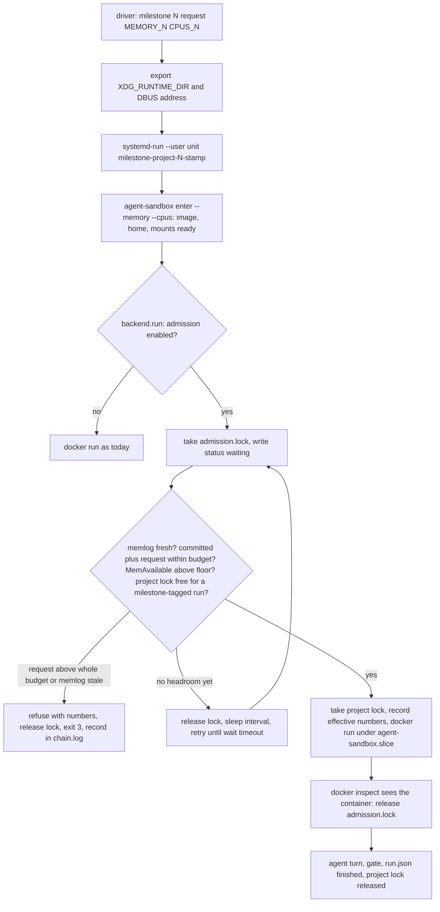
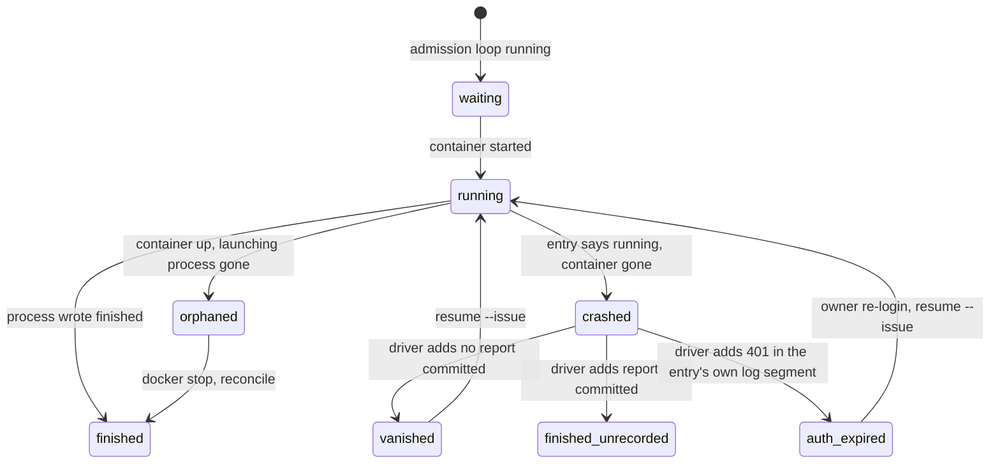

# Milestone Run Hardening - Plan

**Target repos:** `agent-sandbox` (this repo, Python CLI at `agent_sandbox/`), the supervisor skill at `~/.claude/skills/milestone-supervisor/` (cited below as `skill/…`), and a project's `.milestones/` folder (cited as `project/.milestones/…`, the live example being `vibeset-dj`).

## Goal Capsule

- **Objective.** An unattended milestone run cannot take the WSL2 VM down, survives the supervising Claude Code process dying, and can be diagnosed and resumed after any of the three deaths seen on 2026-09-13 (supervisor killed, VM rebooted, agent turn ended by a revoked token) without losing the sandbox's work or guessing its state.
- **Means.** Admission control inside agent-sandbox (KTD1, KTD2), launches as systemd user units (KTD3), a state reconciliation and resume routine (KTD4), a standing memory log the launcher fails closed on (KTD5), and caps on what runs inside and beside a sandbox (KTD6, KTD7, KTD8).
- **Authority.** This plan; then `SPEC.md` and `PLAN.md` in agent-sandbox for its existing contracts (R-13 concurrency without global locking stays true by default); then `skill/SKILL.md` for the supervisor's loop.
- **Stop conditions.** Stop and report if enforcing a memory limit turns out not to bind inside rootless containers on this host (it did bind in a probe on 2026-09-13), if `systemd --user` units cannot be started from the supervisor's process context after exporting the bus variables, or if a unit under `agent_sandbox/` cannot be tested without a live Docker daemon and no fake is reasonable.
- **Execution profile.** One implementer, sequential units, each landing as its own commit in its repo. Docker and systemd are available on the implementer's host; tests that need them are marked and skipped elsewhere.
- **Finish and ship.** The implementer runs the verification contract; the supervisor merges and applies the `.wslconfig` recommendation with the owner.

---

## Product Contract

### Summary

Make agent-sandbox refuse or queue work the host cannot hold, make the supervisor's launches independent of the supervisor's life, and give both a shared, truthful picture of what is running so a dead run is recognized and resumed rather than relaunched or ignored.

### Problem Frame

Twice on 2026-09-13 the WSL2 VM (memory cap 48 GB of 64 GB physical) stalled and rebooted while two agent-sandbox containers, each allowed 16 GB, ran beside a full test suite with onnxruntime, a Docker image build and several parallel research subagents on the host. Windows wrote crash dumps for node, dockerd and systemd with SIGBUS and SIGSEGV each time. Memory over-commit is the leading hypothesis, not a confirmed cause: the journals of the dead boots hold no OOM-killer entry, the `Clock change detected` lines near each death also recur routinely, and both deaths coincide with a container starting or stopping. The competing hypothesis is the documented hang of `autoMemoryReclaim=gradual` with systemd inside the distro, which KTD10 addresses. Either way, nothing in agent-sandbox, the driver or the skill accounts for total memory today: per-container limits bind, but their sum plus host load can exceed what the VM holds, and the `.wslconfig` already records an earlier crash of that shape from page-cache growth. The memory logger lands first so the next run settles which hypothesis holds.

Independently, every launch ran as a foreground child of the supervising session under `nohup`, so the supervisor dying killed the driver and its containers; `runs/<id>/run.json` stays at `running` forever because only the same Python process ever writes `finished`; and a run whose container vanished mid-turn had no routine to diagnose it, so the supervisor reconstructed state by hand three times in one day. The driver also once launched a milestone into another milestone's worktree by picking the newest worktree by modification time.

### Key Decisions

- **Admission and the lock are opt-in inside agent-sandbox, not a change to its default.** `SPEC.md` R-13 requires concurrent sandboxes without global locking, and `REVIEW.md` verifies it; the supervisor's host enables admission in its config. Governs R1, R2, R3, R9.
- **The lock is per project; the budget is global.** One milestone per project at a time, and every container on the host counts against the memory budget whoever launched it. Governs R1, R9.
- **Resume diagnoses and proposes by default; it acts only behind a flag.** Governs R6.
- **The owner applies the `.wslconfig` change; the plan only recommends it.** Governs R12.

### Requirements

**Admission**

- R1. agent-sandbox, when admission is enabled in config, admits a container only if the memory already committed on the host plus the request stays within the configured budget, where a container with a limit commits its limit and a container without one commits its live usage from the newest memory-log sample plus a quarter, or the whole budget when no fresh sample names it, the host's `MemAvailable` is above the configured floor, and no other milestone holds the project's lock.
- R2. A request larger than the whole budget is refused at once with the numbers; a request larger than the current headroom waits up to a configured timeout, re-checking on an interval, then fails with the numbers.
- R3. An admission holds one host-wide file lock from its first reading through `docker run` until the new container is visible to `docker inspect` or thirty seconds pass, so two launchers cannot both pass on a stale snapshot; the per-project milestone lock is a second lock, taken by agent-sandbox for a run tagged with a milestone and held until that run returns, and a lock whose holder process is dead is reclaimed.
- R4. The launcher prints the effective budget, floor, request and their sources (flag, env, config, live reading) before starting a container, and records them in `run.json`.

**Launch and lifetime**

- R5. Each launch runs one milestone as a transient `systemd --user` unit with stdout and stderr appended to a file under the project's `logs/milestones/`, a unit-level runtime ceiling covering every agent-sandbox timeout the unit will issue (the milestone's timeout plus the gate's) plus five minutes, and a name that encodes project, milestone and start time; the driver refuses more than one milestone per invocation, tags every agent-sandbox call inside the unit with the unit name and milestone number, and exports the user bus variables before calling `systemd-run` so a launch from a non-login process works.
- R6. Two layers derive state. agent-sandbox's `status` derives, per container entry in `run.json` and from `docker inspect`, one of waiting, running, crashed (entry says running, container gone), orphaned (container up but its launching process is gone) or finished, takes the sandbox's state from its newest entry, and exposes it as JSON. The driver's `status` and `resume` add the milestone meaning from the run's tags: whether the unit exists, whether the milestone report is committed, whether the entry's own log segment ends in a 401, and so label a sandbox vanished, finished-unrecorded or auth-expired, print the diagnosis (last output line, dirty tree, report present) and the exact finishing command, and with `--issue` launch it.
- R7. Every stale container entry in `run.json` is corrected by the reconciliation (`crashed` or `orphaned`, with the evidence), and the top-level status follows the newest entry, never left at `running`; the reconciliation re-reads the record immediately before writing and writes nothing if the record changed under it.

**Host protection**

- R8. A memory logger runs every minute as a persistent `systemd --user` timer and appends one line per sample with a boot id, a monotonic timestamp, `MemAvailable`, swap used, and each running container's name and current memory read from its cgroup file; the launcher reads the last sample's age itself and refuses admission when the newest sample is older than three minutes or missing; the log spanning a full milestone run records the minimum `MemAvailable` seen, so the crash hypothesis is measured.
- R9. On this host, `~/agent-sandbox/config.json` sets per-container resources to 8 GB memory, 6 CPUs and swap disabled (`memory_swap` equal to `memory`), an aggregate budget of 16 GB and a floor of 8 GB of `MemAvailable`; every managed container runs under one user cgroup slice whose `MemoryMax` equals the budget, so the budget holds continuously, not only at admission; the shipped defaults in source stay as `SPEC.md` R-03 states them; a project declares per-milestone memory and CPU requests in `.milestones/config` and the driver passes them per run.
- R10. Every container gets thread caps for compute libraries derived from its CPU limit (`OMP_NUM_THREADS`, `OPENBLAS_NUM_THREADS`, `MKL_NUM_THREADS`, and a documented `AGENT_SANDBOX_THREADS` the project can read; `AGENT_SANDBOX_CPUS` stays the host-side override `SPEC.md` R-03 defines), and an image build, explicit through the `build` subcommand or fingerprint-triggered on first use, is refused while any managed container runs unless forced.

**Supervisor discipline**

- R11. The supervisor skill states that while a sandbox runs the supervisor keeps at most two research subagents in flight, runs no test suite on the host, and starts no image build; and that right after a launch it reads `status`, since admission runs inside the unit and a refusal or a wait is visible only there.
- R12. The skill's setup documents the `.wslconfig` recommendation for this host and the fact that a host re-login revokes the token a running agent holds.

### Success Criteria

- With admission enabled, a second milestone launch for the same project is refused or queued, never started, and the refusal names the numbers it used.
- Killing the supervising shell after a launch leaves the unit, the container and the log advancing; the run finishes and records itself.
- After a simulated crash (container removed, unit stopped, `run.json` left at running), the driver's `status` reports vanished and `resume` prints the correct finishing command. On the two real records from 2026-09-13, `vibeset-dj-ecfa0e5c` derives to vanished with its finishing command, and `vibeset-dj-0439a7a7` derives to finished (its newest entry recorded a failure) with its seven earlier stale entries corrected to crashed.
- No launch is admitted while the memory log is stale, and a stale log is reported as a distinct condition, not as free memory.

### Scope Boundaries

- No daemon or queue service: admission is a check inside each launch, serialized by a file lock.
- No change to how agent-sandbox isolates a container, mounts a worktree, or seeds secrets.
- No Windows-side automation: the `.wslconfig` change and `wsl --shutdown` are the owner's.
- No changes to vibeset-dj application code; its `.milestones/config` gains keys only.

#### Deferred to Follow-Up Work

- A CPU budget enforced at admission (this plan records CPU requests and caps threads, and only memory is admitted against a budget).
- Analyzing the Windows crash dumps; `maxCrashDumpCount` is only capped.

### Sources

- `agent_sandbox/cli.py` (`cmd_run`, `cmd_enter`, `build_parser`, `KNOWN`), `agent_sandbox/config.py` (`resolve`, `DEFAULTS`, `LOCK_DIR`), `agent_sandbox/worktree.py` (`DirectLock`, `has_uncommitted_work`, `unpushed_commits`), `agent_sandbox/docker_backend.py` (`build_args`, `run`, `_kill`, `list_containers`), `agent_sandbox/metadata.py` (`RunRecord`), `agent_sandbox/cleanup.py` (`survey`, `disk_free_gb`), `agent_sandbox/doctor.py` (`Check`, `_sandbox_probe`), `agent_sandbox/image.py` (`ensure`, `build`), `agent_sandbox/resources.py`.
- `SPEC.md` R-03, R-09, R-10, R-13, R-17; `REVIEW.md` concurrency and cgroup enforcement results; `README.md` "What it does not stop".
- `skill/run-milestones.sh`, `skill/SKILL.md`, `skill/SETUP.md`; `project/.milestones/config`; `project/logs/milestones/chain.log` INCIDENT line of 2026-09-13 14:41.
- Learnings: `vibeset-dj/docs/solutions/testing-practices/a-harness-that-grades-your-own-work-must-fail-closed.md`, `vibeset-dj/docs/solutions/conventions/measurement-harness-silence-must-never-read-as-success.md`, `vibeset-dj/docs/solutions/integration-issues/llm-adjudication-silently-disabled-by-stale-env-model-override.md`.
- External: Microsoft Learn `wsl-config` (memory, swap, `autoMemoryReclaim`, `crashDumpFolder`, `maxCrashDumpCount`); microsoft/WSL issues 10675 and 11066 (`autoMemoryReclaim=gradual` hangs with systemd in the distro); Docker resource-constraints docs (`--memory-swap` equal to `--memory` disables swap; `--oom-kill-disable` is inert on cgroup v2); rootlesscontaine.rs (controller delegation; cgroup paths for rootless containers); man `systemd-run` and `systemd.exec` (`--collect`, `StandardOutput=append:`, `RuntimeMaxSec`, `--setenv`); Arch Wiki Systemd/User and Systemd/Timers (linger, persistent timers over transient ones); man `proc_meminfo` (`MemAvailable`); BashFAQ/045 (`flock` for check-then-act).

---

## Planning Contract

### Key Technical Decisions

- KTD1. **Admission lives in a new `agent_sandbox/admission.py`, enabled by flat `admission_*` keys in `config.json`, default off, and runs inside the Docker backend's own start path.** Off, agent-sandbox behaves exactly as today, which keeps `SPEC.md` R-13 true. On, `LocalDockerBackend.run()` calls it immediately before `docker run`, after image, home and mounts are ready, so every caller of the library, the CLI included, passes through it (`SPEC.md` R-12) and the window between admission and the container's existence is milliseconds inside one function. The budget counts every running Docker container, not only managed ones: a limited container commits its `HostConfig.Memory`; an unlimited one commits its live usage from the newest memory-log sample plus a quarter, or the whole budget when the sample does not name it, so an uncapped MCP server on this host neither deadlocks admission nor escapes it. The floor reads `MemAvailable` from `/proc/meminfo`. Keys are flat scalars (`admission_enabled`, `admission_memory_budget`, `admission_mem_floor_gb`, `admission_wait_timeout_s`, `admission_wait_interval_s`, `admission_memlog_max_age_s`), each with an `AGENT_SANDBOX_ADMISSION_*` entry in `config.py`'s environment map so the env tier R4 reports is real, and `config set` learns to parse `true`, `false` and `null`. `acquire()` runs before `RunRecord.start()` and writes `status: waiting` with `waiting_since` on the record's new container entry before its first wait iteration, so a launch in the wait loop is visible as waiting rather than as finished or vanished. `(session-settled: user-approved — chosen over a driver-only check: a check only the supervisor runs would not protect a launch from any other path; chosen over always-on: R-13.)`
- KTD2. **Two locks, both held by agent-sandbox.** A host-wide `flock` on `LOCK_DIR/admission.lock` held from the first reading through `docker run` until `docker inspect` of the new container succeeds or thirty seconds pass, so the window between a decision and the container's existence is covered by the lock itself and no ledger is needed. A per-project milestone lock file `LOCK_DIR/milestone-<repo-hash>.lock`, taken by `acquire()` only for a run carrying a `milestone` tag and released in `LocalDockerBackend.run()`'s cleanup alongside the existing workspace release, keyed by the agent-sandbox process id; the driver never touches it; an untagged `enter` (an inspection) passes the budget but skips this lock. `DirectLock`'s stale-PID logic in `worktree.py` is factored into `locks.py`, which both locks use, so a lock whose holder died is reclaimed while its still-running container keeps counting against the budget. Waiting is a loop that releases and re-takes the admission lock each interval (default 30 s) until the wait timeout (default 30 min); a request above the whole budget fails before any wait.
- KTD3. **The driver launches one milestone per invocation with `systemd-run --user`, and agent-sandbox keeps its own timer.** The unit gets `--collect`, `--unit=milestone-<project>-<n>-<stamp>`, `StandardOutput=append:` and `StandardError=append:` to `logs/milestones/`, `RuntimeMaxSec` equal to the milestone timeout plus the gate's thirty minutes plus five minutes (a `--continue` unit: the timeout plus five minutes), and `--setenv` for `PATH`, `HOME` and the variables the driver needs; the driver exports `XDG_RUNTIME_DIR` and `DBUS_SESSION_BUS_ADDRESS` from the uid before calling it, and passes `--tag unit=<unit> --tag milestone=<n>` on every agent-sandbox call inside the unit. A request for several milestones at once is refused: the supervisor reviews between milestones, so chaining inside a unit would skip that step. agent-sandbox's in-process `_kill` timer stays the primary timeout because the unit outlives the shell anyway; the unit ceiling only covers the case where the Python process dies and the container does not.
- KTD4. **State is derived, never trusted, in two layers that respect agent-sandbox's non-goals.** `agent_sandbox/state.py` derives, per entry in `run.json`'s `containers` list, waiting, running, crashed or finished from the entry and `docker inspect`, and orphaned when the container is up but the process recorded in the entry is gone; the sandbox's state is its newest entry's; `cmd_status` prints the table and `--json` including each run's tags and each entry's stdout byte offsets. Milestone meaning stays in the driver, because `SPEC.md` names milestone orchestration a non-goal: `run-milestones.sh status` joins `agent-sandbox status --json` with `systemctl --user list-units` on the `unit` tag and with the project's report directory on the `milestone` tag, scans only the newest entry's own log segment (between its recorded start and end offsets) for a 401, labels vanished, finished-unrecorded and auth-expired, and `resume` prints or issues the finishing command. The write-back is guarded: the reconciliation re-reads the record immediately before writing and abandons the write if any entry it would change differs from what it read, because the live sandbox process writes the same file with plain atomic renames and no version check. `(session-settled: user-approved — print by default, act behind a flag; chosen over automatic relaunch: a wrong automatic finishing turn costs a Bedrock run and can double-apply fixes.)` `(session-settled: user-approved — print by default, act behind a flag; chosen over automatic relaunch: a wrong automatic finishing turn costs a Bedrock run and can double-apply fixes.)`
- KTD5. **The memory logger is a persistent user timer, lands first, and the launcher checks staleness with the boot id and a monotonic clock.** `agent-sandbox memlog install` writes `~/.config/systemd/user/agent-sandbox-memlog.{service,timer}` and enables them; each sample line carries `/proc/sys/kernel/random/boot_id`, `CLOCK_MONOTONIC` seconds, wall time, `MemAvailable`, `SwapFree`, and per-container `name=bytes` read from each container's `memory.current` under the user's delegated cgroup tree (`docker ps` gives the ids; `docker stats` takes two seconds on this host and is the fallback only when the file is absent). The parser lives in `memlog.py` and `admission.py` imports it. Admission reads the last line, treats a different boot id or a monotonic age over 180 s as stale, and refuses; a missing log refuses too. This is the fail-closed rule from the harness learnings applied to the instrument that gates launches.
- KTD6. **Thread caps come from `ResourceConfig`.** A `thread_env()` method returns the four variables from `min(cpus, 4)`; `mounts.plan_for()` merges it next to the git identity env so every backend gets it. `AGENT_SANDBOX_THREADS` is the documented handle for a project's own thread settings (onnxruntime reads no standard variable); the name is new because `AGENT_SANDBOX_CPUS` already means the host-side CPU override.
- KTD7. **Build guard as one helper both build paths call.** `cmd_build` calls `image.build()` directly and never `ensure()`, so the guard is a helper, `refuse_build_while_running(list_containers, force)`, called by `cmd_build` before `image.build()` and by `ensure()` before a fingerprint-triggered rebuild; it raises an `ImageError` naming the running containers unless `--force-build`. A launch whose image is stale therefore fails fast with the remedy "build when idle" rather than building beside a running sandbox.
- KTD8. **This host's config, not the shipped defaults, sets 8 GB, 6 CPUs, no swap, budget 16 GB, floor 8 GB, and a kernel slice holds the budget continuously.** `config.resolve` reads `~/agent-sandbox/config.json` before `DEFAULTS`, so the numbers change here without touching every consumer of the library, and `SPEC.md` R-03's deliberately generous shipped default stands. `memory_swap` is a new key `ResourceConfig` resolves per run, defaulting to the resolved `memory`, and `docker_args()` passes `--memory-swap`. When admission is enabled, `docker_args()` also passes `--cgroup-parent=agent-sandbox.slice` and `agent-sandbox admission install` sets that user slice's `MemoryMax` to the budget through `systemctl --user set-property`, so no set of managed containers can exceed the budget at any moment, not only at launch; `doctor` checks the slice's `memory.max`. Whether rootless Docker accepts a user-manager slice as cgroup parent is verified by a probe in U7; if it refuses, the fallback is `MemoryMax` on the whole user service, which the owner sets. Per-milestone requests come from `.milestones/config` as `MEMORY`, `CPUS` defaults and `MEMORY_<n>`, `CPUS_<n>` overrides, passed as `--memory`/`--cpus` on `run` and `enter`. `(session-settled: user-directed — per-job memory tunable against other compute, chosen over one fixed cap per container.)` `(session-settled: user-directed — per-job memory tunable against other compute, chosen over one fixed cap per container.)`
- KTD9. **Tests for the new pure logic use pytest under `tests/`, new to this repo and run through `uv run --with pytest` since the host Python has no pytest and the repo adds no packaging; live behavior is verified by new `doctor` checks.** The admission math, state derivation, sample parsing and config resolution are pure functions that take injected readings (a fake `MemAvailable`, a fake container list, a fake `run.json`), so they test without Docker. Docker-dependent behavior (a limit binding, the slice cap, a build refused while a container runs) becomes `Check`s in `doctor.py`, which is this repo's existing correctness net; the sandbox probe inside `doctor` bypasses admission with the same `force` path so a stale memory log is reported as one cause, not as a failed probe.
- KTD10. **The `.wslconfig` recommendation is `memory=40GB`, `autoMemoryReclaim=dropCache`, `maxCrashDumpCount=2`, unchanged `swap=16GB`.** 40 GB leaves Windows 24 GB; `dropCache` avoids the documented `gradual` hang with systemd in the distro; two dumps cap the disk cost of a 60 GB dump. Recorded in `skill/SETUP.md` for the owner.
- KTD11. **Admission also refuses on host disk, because the 16:34 death was disk, not memory.** `(added during ce-work after the fourth reboot)` The memory log's last sample before the 16:34 reboot showed 48 GB `MemAvailable`; the Windows drive holding the distro's `ext4.vhdx` had 1.1 GB free and the image was not sparse (`fsutil sparse queryflag`), so a write burst needing new allocation (an image build, the agent-home copy at launch) failed with SIGBUS across processes until init died. Every one of the day's four crashes coincided with such a burst. So `decide()` takes `disk_free` readings and refuses when the host drive backing the guest (`admission_disk_path`, default `/mnt/c` when `/proc/version` names Microsoft, else `/`) or the guest root is below `admission_disk_floor_gb` (default 20); the memory log records `disk_free` per sample so the log shows the approach; `doctor` checks the host drive floor and, on WSL, that the vhdx is sparse through `fsutil` over interop. The owner fix (`wsl --shutdown`, `wsl --manage <Distro> --set-sparse true`, `fstrim`) is recorded in `skill/SETUP.md`.

### High-Level Technical Design

Launch and admission, as the driver and agent-sandbox now share it:

Sandbox state as agent-sandbox derives it per container entry, and the labels the driver adds:

### System-Wide Impact

- **Other containers on the host.** Admission counts every container, so the Terraform MCP server started by the project's `.mcp.json` counts by live usage; U6 gives it a memory limit before admission is enabled so it counts by a small fixed limit instead.
- **agent-sandbox's other users.** With `admission_enabled` off, nothing changes: no lock, no ledger, no new output. The new subcommands and keys are additive; `SPEC.md` R-03 and R-13 hold as written.
- **The Docker daemon and the systemd user manager.** A dockerd restart ends every container (`--rm`) while units keep running until their command exits; the reconciliation reports those runs as vanished. A user-manager restart or host reboot drops transient units and the timer; the persistent timer re-arms at login, and the driver re-exports the bus variables on every launch.
- **The memory log as a dependency.** With the timer dead, every admission refuses within three minutes; that is intended, and `doctor` names the dead timer.
- **`run.json` as a shared record.** Two writers now exist, the live process and the reconciliation; the guard in KTD4 keeps them from stomping each other.
- **The supervisor's loop.** The watch step reads `status` instead of polling the worktree by hand; the finishing follow-up becomes a `resume` output rather than prose the supervisor types.
- **Projects.** `.milestones/config` gains optional keys; a project without them gets this host's defaults.

### Risks & Dependencies

- `--cgroup-parent=agent-sandbox.slice` under rootless Docker is verified only from the existing cgroup paths, not by starting a container; U7's probe settles it, and the fallback is a `MemoryMax` on the whole user service that the owner sets.
- Until a memory log spans a VM death, memory over-commit and the `autoMemoryReclaim=gradual` hang cannot be told apart; if the latter is the cause, KTD10 alone ends the reboots and admission's value is confined to bounding what containers can take.
- `RuntimeMaxSec` stops the unit, not the container; the reconciliation handles the orphaned container. A unit-level `MemoryMax` is deliberately not set because the container runs under dockerd's cgroup, not the unit's. If the Python process dies before its own timer fires, nothing stops the container until `resume --issue` does, so the objective's "cannot take the VM down" rests on the per-container memory cap and the aggregate budget, not on a lifecycle guarantee.
- `autoMemoryReclaim=dropCache` trades the earlier page-cache benefit of `gradual` for freedom from the systemd hang; if the owner sees page-cache creep again the fallback is `disabled` plus a lower cap.
- The per-project lock uses the repo path hash; two checkouts of the same project count as two projects.
- Two live `enter` processes on one sandbox still overwrite each other's `run.json` (how the 14:38 finishing turn's result was lost to the 14:41 misdirected run); the per-project lock prevents the double entry only while admission is enabled and both runs carry a milestone tag.

---

## Implementation Units

Units land in the order below; U3 first so the instrument that decides the crash hypothesis exists before anything depends on it. U-IDs are stable and are not renumbered by the reorder.

### U3. Memory logger timer and staleness contract

- **Goal.** A persistent one-minute memory log exists on the host, its samples parse with a staleness rule, and it records the reading that settles the crash hypothesis.
- **Requirements.** R8. Cites KTD5.
- **Dependencies.** None.
- **Files.** `agent_sandbox/memlog.py` (new: `sample`, `install`, `parse_last_sample`, `minimum_since`), `agent_sandbox/cli.py` (`memlog install|sample|show` subcommand following the `build_parser` pattern and `KNOWN`), `templates/systemd/agent-sandbox-memlog.service` and `.timer` (new), `agent_sandbox/doctor.py` (a check that the timer is active and the last sample is fresh), `tests/test_memlog.py` (new), `tests/conftest.py` (new).
- **Approach.**
  1. `sample()` writes one line to `~/agent-sandbox/logs/memory.log`: boot id, monotonic seconds, ISO time, `MemAvailable`, `SwapFree`, and `name=bytes` per running container, read from that container's `memory.current` under the user's delegated cgroup tree (ids from `docker ps`), with `docker stats --no-stream` as the fallback when the file is absent.
  2. `install` writes the two unit files from templates and runs `systemctl --user enable --now`; `show` prints the last samples and the minimum `MemAvailable` since a given time.
  3. `parse_last_sample(path, boot_id, monotonic_now)` returns the newest sample with its age or a stale marker (different boot id, age over the configured maximum, missing or malformed).
  4. The log rotates by truncating to the last 10 000 lines when it grows past 20 000, in `sample()`.
- **Execution note.** Smoke-verify the timer on the host after install; the parser and the cgroup path resolution are unit-tested with fixture files.
- **Patterns to follow.** `cleanup.disk_free_gb` for a small reading function; `doctor.Check` for the health row; `templates/agent-home` for shipped template files.
- **Test scenarios.**
  - A line from the current boot 60 s old: fresh, values parsed.
  - A line from another boot id: stale.
  - A line 200 s old by monotonic clock: stale even if wall time reads recent.
  - Missing file or empty file: stale.
  - A malformed last line: stale with a parse reason, earlier lines ignored.
  - Rotation keeps the newest lines.
  - `minimum_since` over a fixture spanning three samples returns the smallest `MemAvailable` and its time.
  - A fake cgroup tree with two container directories: the sample names both with their `memory.current` values; a missing directory falls back to the injected `docker stats` reader.
- **Verification.** `uv run --with pytest python3 -m pytest tests/test_memlog.py -q` passes; `systemctl --user list-timers` shows the timer; two minutes later the log has two new lines; `agent-sandbox doctor` reports the memlog check green.

### U1. Admission, locks and config keys

- **Goal.** agent-sandbox admits a container only within the memory budget, floor, memlog freshness and project lock when admission is enabled, holds the budget in a kernel slice, and reports the effective numbers.
- **Requirements.** R1, R2, R3, R4, R9. Cites KTD1, KTD2, KTD8.
- **Dependencies.** U3 (the sample parser).
- **Files.** `agent_sandbox/admission.py` (new: `decide`, `acquire`, `committed_memory`), `agent_sandbox/locks.py` (new: the stale-PID lock base factored out of `worktree.DirectLock`, which becomes a subclass), `agent_sandbox/config.py` (`DEFAULTS`: the six flat `admission_*` keys with admission off; the six `AGENT_SANDBOX_ADMISSION_*` entries in the environment map), `agent_sandbox/resources.py` (`memory_swap` resolved per run, `--memory-swap` and, when admission is enabled, `--cgroup-parent=agent-sandbox.slice` in `docker_args`), `agent_sandbox/docker_backend.py` (`run` calls `acquire` before `RunRecord.start`, holds the admission lock until `docker inspect` sees the container, releases the project lock in its cleanup; `add_container` records the launching process id and the stdout byte offset at start, `finish_container` the offset at end), `agent_sandbox/cli.py` (`--wait`/`--no-wait`, `--force` and repeatable `--tag key=value` on `run` and `enter`; `admission install` sets the slice `MemoryMax`; `config set` parses booleans and null; exit code 3 and a `--json` refusal payload for admission refusal or timeout), `agent_sandbox/errors.py` (`AdmissionRefused`, `AdmissionTimeout` with remedies), `agent_sandbox/metadata.py` (`RunRecord` gains `tags`, `admission` with the effective numbers and sources, `wait()`, and the per-entry `pid`, `stdout_offset_start`, `stdout_offset_end`), `tests/test_admission.py` (new), `tests/test_locks.py` (new).
- **Approach.**
  1. `decide(request, committed, mem_available, memlog_sample, project_locked, cfg)` is a plain function that returns admit, wait or refuse with a reasons list and the effective numbers; `committed_memory(inspect_rows, memlog_sample, budget)` computes the committed total per KTD1.
  2. `acquire()` takes the admission `flock`, writes the entry's `waiting` status, loops on wait per KTD2, takes the project lock when the run carries a `milestone` tag, prints the effective numbers per R4, and returns a handle the backend releases once `docker inspect` succeeds or thirty seconds pass.
  3. Config resolution follows `config.resolve` precedence; keys stay scalar so `config set` works.
  4. `admission install` runs `systemctl --user set-property agent-sandbox.slice MemoryMax=<budget>` and records the result.
- **Patterns to follow.** `worktree.DirectLock` for PID-stale locks (now via `locks.py`); `cleanup.disk_free_gb` plus `disk_warn_gb` for the floor shape; `errors.SandboxError` subclasses with `.remedy` for refusals; `cleanup.survey` as the plain-function shape; `RunRecord.save` for atomic writes.
- **Test scenarios.**
  - Admission disabled: `decide` returns admit with no reasons regardless of inputs.
  - Request 8g, budget 16g, one running container at 8g, floor met, memlog fresh: admit, effective numbers list sources.
  - Request 12g, budget 16g, one running at 8g: wait with reason "headroom 8g below request".
  - Request 20g, budget 16g: refuse at once, reason names request and budget, no wait.
  - Running container with unlimited memory and a fresh sample naming it at 2g: committed as 2.5g; the same container absent from the sample: committed as the whole budget.
  - `MemAvailable` 6g with floor 8g: wait, reason names the floor.
  - Memlog sample older than 180 s, or with a different boot id, or missing: refuse, reason "memory log stale".
  - A run with a `milestone` tag while the project lock is held by a live PID: wait; held by a dead PID: reclaimed, admit; an untagged run: the project lock is neither checked nor taken.
  - Two `acquire` calls racing in threads with a fake inspect that reports the first container after one second: the second serializes on the flock and counts the first's container.
  - Wait timeout elapses: fails with the last reasons; the record's entry reads `waiting` throughout and `failed` after.
  - `config set admission_enabled false` stores a boolean false, not the string; `AGENT_SANDBOX_ADMISSION_MEMORY_BUDGET=24g` wins over `config.json` and is reported as sourced from env.
  - A refusal exits 3 and, with `--json`, prints the reasons and numbers as one object.
  - `--tag unit=x --tag milestone=6` lands in `run.json` under `tags`.
- **Verification.** `uv run --with pytest python3 -m pytest tests/test_admission.py tests/test_locks.py -q` passes; with admission enabled in a scratch config, `agent-sandbox run <repo> -- true` prints the effective numbers line, `run.json` carries `admission`, `tags` and the entry offsets, and `docker inspect` of the container shows `agent-sandbox.slice` as its cgroup parent.

### U2. State reconciliation and status in agent-sandbox

- **Goal.** `agent-sandbox status` tells the truth about every container entry of every sandbox and corrects stale records safely.
- **Requirements.** R6 (the agent-sandbox layer), R7. Cites KTD4.
- **Dependencies.** U1 (the `pid`, offsets and `tags` fields).
- **Files.** `agent_sandbox/state.py` (new: `derive_entry`, `derive_record`, `reconcile`), `agent_sandbox/cli.py` (`cmd_status` with `--json`, parser block, `KNOWN`, dispatch), `agent_sandbox/metadata.py` (`mark_entry` with the re-read guard), `agent_sandbox/cleanup.py` (`survey` reuses `derive_record`), `tests/test_state.py` (new), `tests/fixtures/runs/` (new: the two 2026-09-13 records, copied).
- **Approach.**
  1. `derive_entry(entry, container_exists, pid_alive)` is pure and returns waiting, running, crashed, orphaned or finished with evidence; `derive_record` applies it to every entry and takes the sandbox state from the newest.
  2. `cmd_status` gathers the inputs per sandbox (`docker inspect` per entry's container name, `os.kill(pid, 0)` per entry) and prints a table or JSON that includes tags, offsets and log paths for the driver.
  3. `reconcile` writes every changed entry and the top-level status once, through the re-read guard.
- **Patterns to follow.** `cleanup.survey` for the per-record walk; `RunRecord.public()` for the JSON shape; `_fail` and remedies for errors.
- **Test scenarios.**
  - Entry running, container exists, pid alive: running.
  - Entry running, container gone: crashed, evidence names the container.
  - Entry running, container exists, pid dead: orphaned.
  - Entry waiting, no container: waiting; entry waiting older than the wait timeout plus one interval with no container: crashed.
  - Entry finished: finished.
  - Record whose newest entry is failed and whose earlier entries are stale running: sandbox state finished, seven entries corrected to crashed (the `vibeset-dj-0439a7a7` fixture).
  - Record whose only entry is running with no container: sandbox state crashed (the `vibeset-dj-ecfa0e5c` fixture).
  - Reconciliation writes once; a second derive on the same record is idempotent.
  - The record changes between read and write: the reconciliation writes nothing and reports the fresh state.
- **Verification.** `uv run --with pytest python3 -m pytest tests/test_state.py -q` passes; on this host `agent-sandbox status --json` shows `vibeset-dj-ecfa0e5c` as crashed and `vibeset-dj-0439a7a7` as finished with its stale entries corrected.

### U4. Thread caps and the build guard

- **Goal.** Every container gets compute thread caps, and no image builds while a sandbox runs, from either build path.
- **Requirements.** R10. Cites KTD6, KTD7.
- **Dependencies.** None.
- **Files.** `agent_sandbox/resources.py` (`thread_env`), `agent_sandbox/mounts.py` (`plan_for` merges it), `agent_sandbox/image.py` (`refuse_build_while_running(list_containers, force)`; `ensure` calls it before a rebuild with an injectable `list_containers`), `agent_sandbox/cli.py` (`cmd_build` calls the helper before `image.build()`; `--force-build` on `build`, `run` and `enter`), `agent_sandbox/errors.py` (`ImageError` remedy text), `agent_sandbox/doctor.py` (a check that a probe container sees `OMP_NUM_THREADS`), `tests/test_resources.py` and `tests/test_image_guard.py` (new).
- **Approach.**
  1. `thread_env()` derives `min(cpus, 4)` for `OMP_NUM_THREADS`, `OPENBLAS_NUM_THREADS`, `MKL_NUM_THREADS` and `AGENT_SANDBOX_THREADS`.
  2. The guard helper lists managed containers through the injected callable; a non-empty list without `force` raises `ImageError` naming them; both `cmd_build` and `ensure` call it.
- **Test scenarios.**
  - cpus 6: all four variables 4; cpus 2: all 2; fractional cpus 1.5: 1.
  - The guard with a fake list of one running container and no force: raises with the container name; with force: passes; with an empty list: passes.
  - `ensure` with a stale fingerprint and a fake running container: raises before any build call; with a fresh fingerprint: no build, no error.
- **Verification.** `uv run --with pytest python3 -m pytest tests/test_resources.py tests/test_image_guard.py -q` passes; `agent-sandbox doctor` shows the thread-env probe green; `agent-sandbox build` while a sandbox runs refuses with the remedy.

### U5. Driver: systemd launch, per-milestone resources, milestone status and resume

- **Goal.** The supervisor's driver launches one milestone per invocation through systemd, passes per-milestone resources and tags, and layers the milestone meaning over agent-sandbox's status.
- **Requirements.** R5, R6 (the driver layer), R9. Cites KTD3, KTD4, KTD8.
- **Dependencies.** U1, U2.
- **Files.** `skill/run-milestones.sh` (launch path, `--continue` path, `--inside` body, new `status` and `resume` verbs, per-milestone `MEMORY_<n>`/`CPUS_<n>` from `.milestones/config`, tags on every agent-sandbox call, refusal of several milestones per invocation), `skill/run-milestones.test.sh` (new: a bash test script with fake `agent-sandbox`, `systemd-run` and `systemctl` on `PATH`), `project/.milestones/config` (new keys with comments).
- **Approach.**
  1. A `launch_unit` function builds the `systemd-run --user` command per KTD3 and runs it; the driver's own body becomes the unit's command via `run-milestones.sh --inside <n> --sandbox <id>`, which runs the milestone turn, then the gate, each as an agent-sandbox call tagged with the unit and milestone.
  2. `resolve_resources n` reads `MEMORY_<n>`, `CPUS_<n>`, then `MEMORY`, `CPUS`, then nothing (agent-sandbox defaults).
  3. Inside the unit, an admission refusal (exit 3 with the JSON payload) is appended to `chain.log` with its reasons and the unit exits non-zero; the outer driver returns as soon as the unit is accepted, and the skill's launch step reads `status` right after.
  4. `status` joins `agent-sandbox status --json` for this project's sandboxes with `systemctl --user list-units --plain` on `tags.unit` and with `REPORT_DIR/milestone-<tags.milestone>.md` committed in the worktree, scans the newest entry's log segment between its offsets for a 401 (last 200 lines when a record has no offsets), and labels vanished, finished-unrecorded and auth-expired.
  5. `resume` prints, per non-terminal sandbox, the diagnosis and the finishing command (the `--continue` form for vanished, a gate run for finished-unrecorded, `docker stop` plus reconcile for orphaned, an owner re-login note before the `--continue` form for auth-expired) and issues it with `--issue`; every line goes to `chain.log`.
- **Execution note.** Test the driver with fakes on `PATH` first; then one real launch of a trivial command in a scratch sandbox.
- **Test scenarios.**
  - Launching milestone 6 with `MEMORY_6=12g` produces a `systemd-run` invocation containing `--memory 12g`, `--tag unit=... --tag milestone=6`, the unit name with project, 6 and a stamp, `StandardOutput=append:` under `logs/milestones/`, and `RuntimeMaxSec` equal to timeout plus 1800 s plus 300 s.
  - `run-milestones.sh 5 6`: refused with the message that the supervisor reviews between milestones; no unit created.
  - No per-milestone key: falls back to `MEMORY`, then to nothing.
  - `XDG_RUNTIME_DIR` unset in the caller: the driver sets it and the bus address from the uid before `systemd-run`.
  - `--continue` also launches through a unit with `RuntimeMaxSec` equal to timeout plus 300 s.
  - Inside the unit, a refused admission (fake agent-sandbox exits 3 with the JSON payload): the reasons land in `chain.log` and the unit's command exits non-zero.
  - `status` with a fake `agent-sandbox status --json` reporting crashed, no unit, no report: vanished with the `--continue` command; with the report committed: finished-unrecorded with the gate command; with a 401 inside the entry's segment: auth-expired with the re-login note; with a 401 only outside the segment: vanished.
  - `status` prints only this project's sandboxes.
- **Verification.** The test script passes; a real launch of `-- true` in a scratch sandbox shows the unit in `systemctl --user list-units`, the log file appended, and the unit gone after exit; killing the launching shell mid-run leaves the unit running.

### U6. Skill and setup text, project config, owner recommendation

- **Goal.** The supervisor knows the new rules and the owner has the `.wslconfig` recommendation.
- **Requirements.** R11, R12. Cites KTD8, KTD10.
- **Dependencies.** U5 (the verbs it documents).
- **Files.** `skill/SKILL.md` (launch step names the unit, the resource keys, one milestone per launch, and the `status` read right after launch; watch step names `status`; a new "Resume" step before the loop for session start; the subagent and host-load limits), `skill/SETUP.md` (admission keys to enable and `admission install`, memlog install, the rule that every long-lived container on the host carries a memory limit, the `.wslconfig` recommendation with `wsl --shutdown`, the credentials section), `project/.milestones/config` (documented `MEMORY`, `CPUS`, per-milestone overrides), `project/.mcp.json` (a memory limit on the Terraform MCP server's `docker run`), `~/agent-sandbox/config.json` (admission enabled on this host, resources and budget per KTD8).
- **Test scenarios.** Test expectation: none -- documentation and configuration; verified by the review checklist below.
- **Verification.** A reader of `SKILL.md` can state the concurrency limits, the one-milestone-per-launch rule and the resume step without the plan; `agent-sandbox config show` on this host prints the admission keys.

### U7. Chaos verification and doctor checks

- **Goal.** The success criteria are checked by a repeatable script, and the live checks live in `doctor`, including the slice probe KTD8 depends on.
- **Requirements.** Success criteria. Cites KTD8, KTD9.
- **Dependencies.** U1 to U5.
- **Files.** `scripts/chaos-check.sh` (new), `agent_sandbox/doctor.py` (checks: admission config sane, memlog fresh, no stale running entries, project locks not held by dead PIDs, the slice's `memory.max` equals the budget, a probe container reports `agent-sandbox.slice` as its cgroup parent; the sandbox probe passes `force` past admission), `PLAN.md` (a verification checklist entry for this work).
- **Approach.** The script, run on a scratch repo: enable admission with a 1g budget; launch one sandbox running `sleep 120`; assert a second launch is refused with numbers; kill the launching shell and assert the unit and container survive; remove the container and stop the unit; assert `agent-sandbox status` shows crashed and the driver's `resume` prints the finishing command; restore config. The slice probe starts one container with `--cgroup-parent=agent-sandbox.slice` and reads its cgroup path back; a refusal is reported as the named fallback in KTD8.
- **Test scenarios.**
  - Each assertion above is one numbered step with an expected line; the script exits non-zero on the first failure and prints which.
- **Verification.** `scripts/chaos-check.sh` exits 0 on this host; `agent-sandbox doctor` shows the six new checks.

---

## Verification Contract

| Check | Command | Applies to |
|---|---|---|
| Pure logic | `uv run --with pytest python3 -m pytest tests/ -q` from the agent-sandbox root | U1, U2, U3, U4 |
| Driver | `bash skill/run-milestones.test.sh` | U5 |
| Live host | `agent-sandbox doctor` all green, including the slice probe | U3, U4, U7 |
| Chaos | `scripts/chaos-check.sh` exits 0 | U1, U2, U5, U7 |
| Real dead sandboxes | `run-milestones.sh resume` lists `vibeset-dj-ecfa0e5c` as vanished with its finishing command and omits `vibeset-dj-0439a7a7`, whose record `agent-sandbox status` shows as finished with seven entries corrected to crashed | U2, U5 |
| Hypothesis check | the memory log spanning the next full milestone run records its minimum `MemAvailable`, and the milestone report states whether it approached the floor | U3 |

No unit in this plan calls a model or spends money; nothing here needs Bedrock.

## Definition of Done

- All units landed as commits in their repos, each with its tests; `uv run --with pytest python3 -m pytest tests/ -q` green in agent-sandbox; the driver test script green; `doctor` green; `chaos-check.sh` exit 0.
- `~/agent-sandbox/config.json` on this host has admission enabled with the KTD8 numbers, the slice cap is set, and the memlog timer is active.
- `skill/SKILL.md` and `skill/SETUP.md` describe the new launch, status, resume and limits; `project/.milestones/config` carries the resource keys; the Terraform MCP server in `project/.mcp.json` carries a memory limit.
- The `.wslconfig` recommendation is written for the owner; the owner's apply step is recorded as an owner action, not done by the implementer.
- No dead-end code from abandoned approaches remains in either repo.
- Per unit: its test scenarios exist and pass, and its verification line holds.
